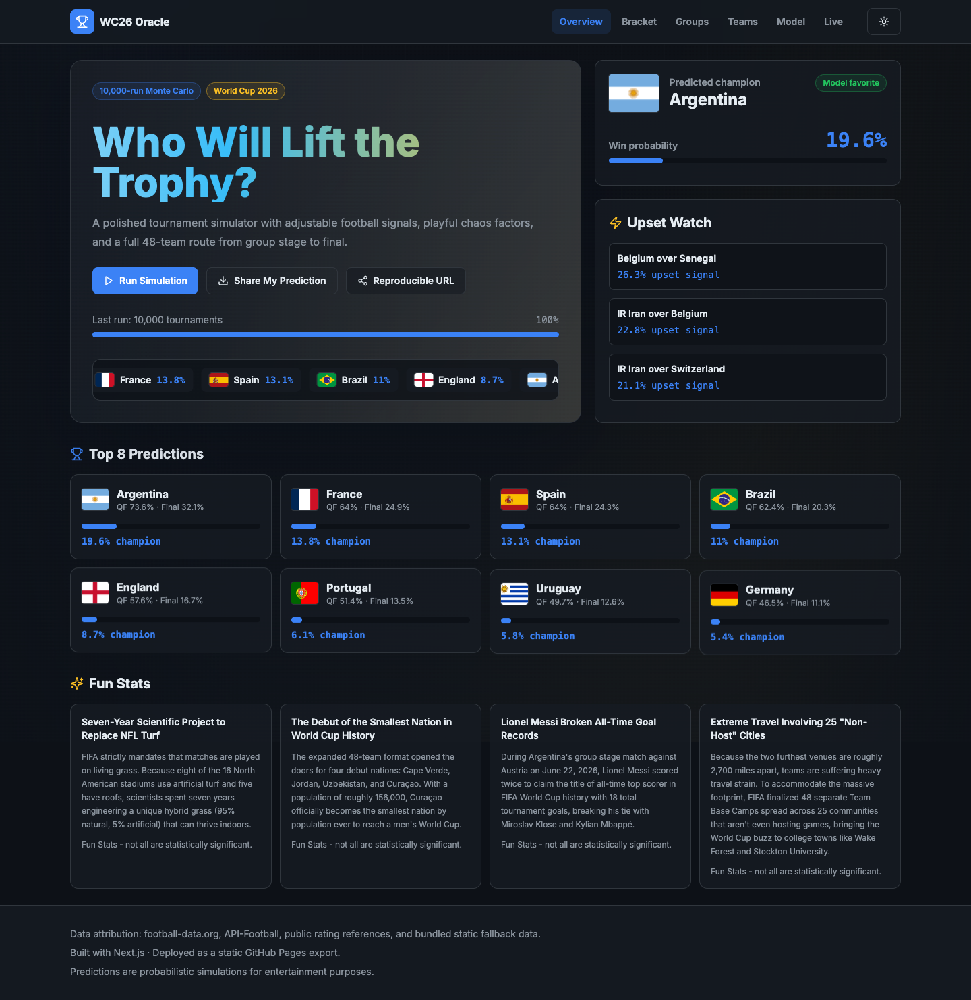
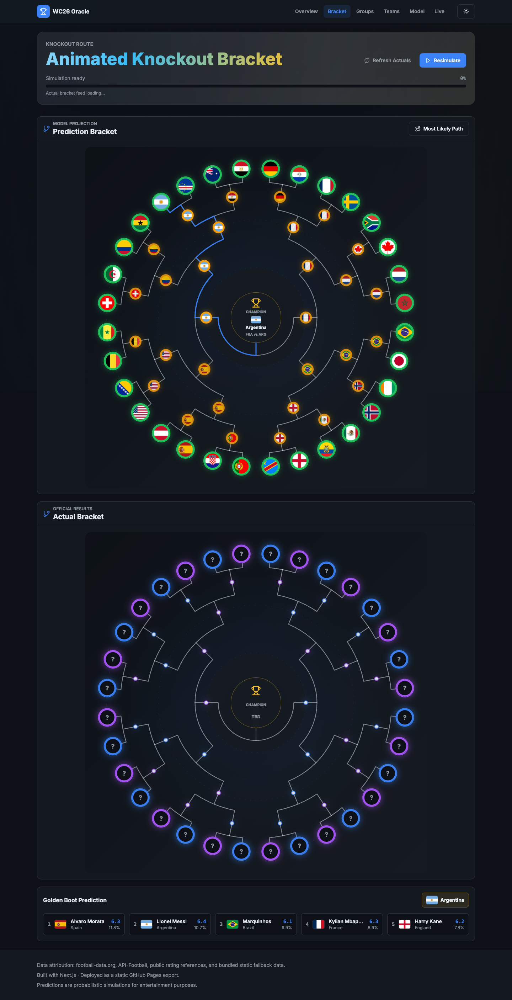
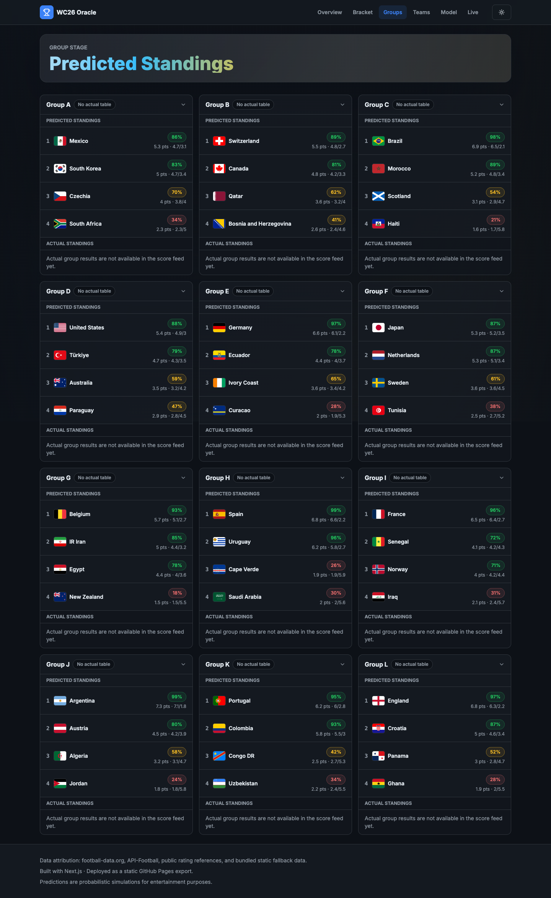
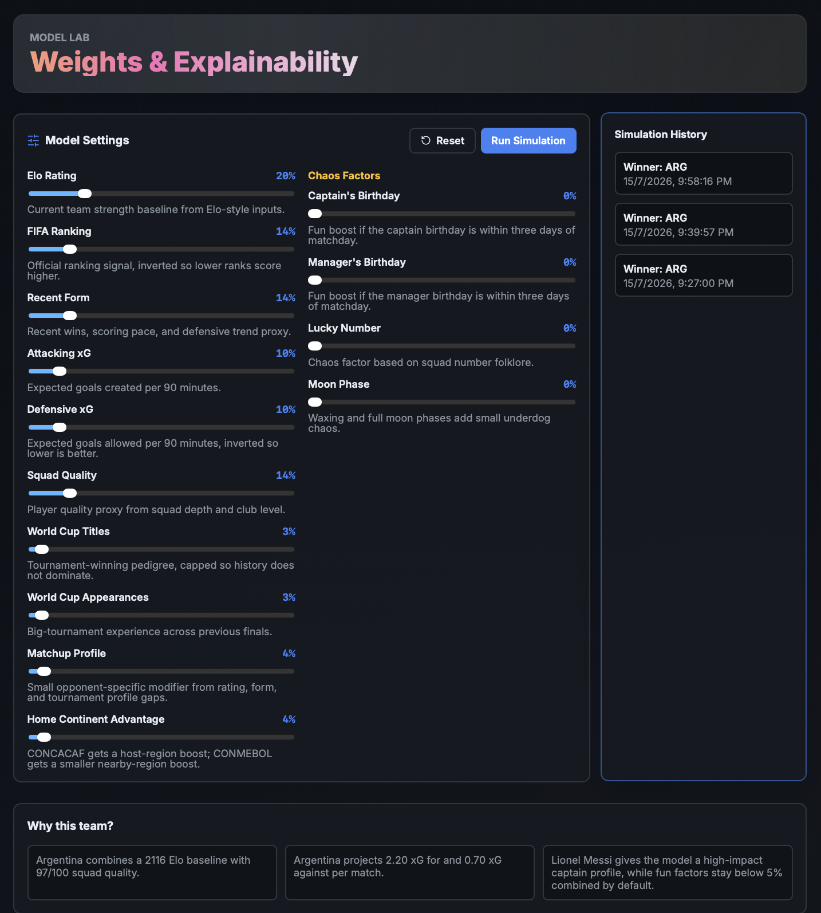

# WC26 Oracle Frontend

Static Next.js dashboard for simulating FIFA World Cup 2026 outcomes.

**Display description:** Monte Carlo World Cup 2026 prediction dashboard with bracket projections, group tables, model controls, and live-score context.

## Screenshots









## Model Factors

Weights are normalized before each run, so raising one signal lowers the relative share of the rest.

- **Elo Rating:** Baseline team strength from Elo-style ratings.
- **FIFA Ranking:** Official ranking signal, inverted so lower ranks score higher.
- **Recent Form:** Recent wins, scoring pace, and defensive trend proxy.
- **Attacking xG:** Expected goals created per 90 minutes.
- **Defensive xG:** Expected goals allowed per 90 minutes, inverted so lower is better.
- **Squad Quality:** Player-depth and club-level roster proxy.
- **World Cup Titles:** Historical winning pedigree, capped to prevent over-weighting history.
- **World Cup Appearances:** Big-tournament experience, capped across prior finals.
- **Matchup Profile:** Opponent-specific mix of rating gap, form gap, and tournament-profile gap.
- **Home Continent Advantage:** CONCACAF host-region boost plus a smaller CONMEBOL nearby-region boost.
- **Captain's Birthday:** Tiny boost if the captain birthday is within three days of matchday.
- **Manager's Birthday:** Tiny boost if the manager birthday is within three days of matchday.
- **Lucky Number:** Small chaos factor from each team's bundled lucky-number value.
- **Moon Phase:** Small moon-phase modifier, especially for underdog chaos.

## Development

```bash
npm install
npm run dev
```

Open `http://localhost:3000`.

## Build

```bash
npm run build
```

The static export is written to `out/`.

## Routes

- `/overview`
- `/bracket`
- `/groups`
- `/teams`
- `/model`
- `/live`
- `/team/[code]`
